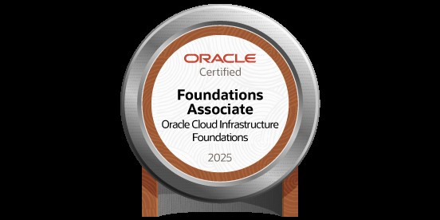
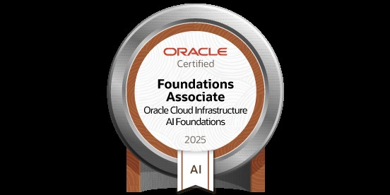

# Hi, I'm César Santos 👋

### Backend Engineer evolving into DevOps & Platform Engineering
### Java/Spring · Python · Kubernetes · Cloud Native | CKA Candidate

> 🌎 Available for **US-remote roles** (Backend / DevOps / Platform) 

Backend engineer with solid experience in **Java/Spring** and **Python**, currently expanding into **Cloud Native infrastructure**, **GitOps**, and **Site Reliability Engineering**. Comfortable across the full stack — from application code to Kubernetes clusters.

🎯 **Currently pursuing**: CKA (Certified Kubernetes Administrator)
📚 **Learning path**: KCNA → CKAD → CKA → CKS + AWS + RHCSA
🇺🇸 **Goal**: US remote opportunities 

---

### 🏆 Certifications

- **[Oracle Cloud Infrastructure 2025 Certified Foundations Associate](https://catalog-education.oracle.com/ords/certview/sharebadge?id=E9D60ECCAD24BAE65F3794C035E8984F13AFB21CCCCEBAB73CECC89C5F20DA34)** — Oracle
- **[Oracle Cloud Infrastructure 2025 Certified AI Foundations Associate](https://catalog-education.oracle.com/ords/certview/sharebadge?id=529BE94A3499D3896BEA37D98D2597F07F1C8547AA1057AA673044851D3CEA9F)** — Oracle
- **[Uncomplicating Docker](https://www.credential.net/4033f97c-52d2-4977-8658-69e3fc411db3)** — LINUXtips
- **Postgraduate in Cybersecurity & Ethical Hacking** — FIAP *(in progress)*

---

### 🎖️ Verified Credentials

<h3>Oracle Cloud Certifications</h3>

  

  

  

---

### 🛠️ Engineering Stack

**Backend Development**

**Cloud Native & Orchestration**

**Infrastructure as Code & CI/CD**

**Observability & Security**

**Cloud Providers**

**OS & Scripting**

---

### 🔭 Current Focus

- 🚀 Building **PICKStack** — a 12-month Cloud Native platform with Kubernetes, GitOps, observability and SLO management
- ☸️ Deep diving into **Kubernetes networking, security and operations** toward CKA certification
- 🤖 Exploring **AI/ML infrastructure** — GPU-accelerated transcription pipelines with WhisperX
- 🇩🇪 Studying **German (B1 target)** alongside English fluency improvement

---

### 🗣️ Languages

- 🇧🇷 Portuguese — Native
- 🇺🇸 English — Intermediate (improving toward fluency)
- 🇩🇪 German — Learning (B1 target by 2026)

---

### 📫 Let's Connect

- 🌐 [cesarsantos.dev](https://cesarsantos.dev)
- 💼 [LinkedIn](https://www.linkedin.com/in/cesar-augusto-dos-santos/)
- 📍 Open to **US remote (USD)** and **EU relocation — Germany 2026**

---

 

 

