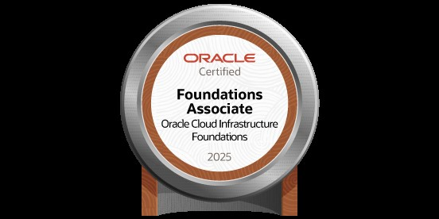
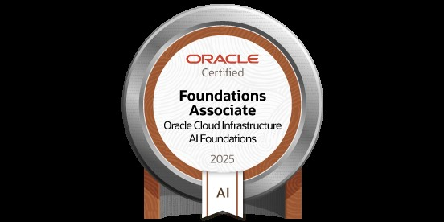
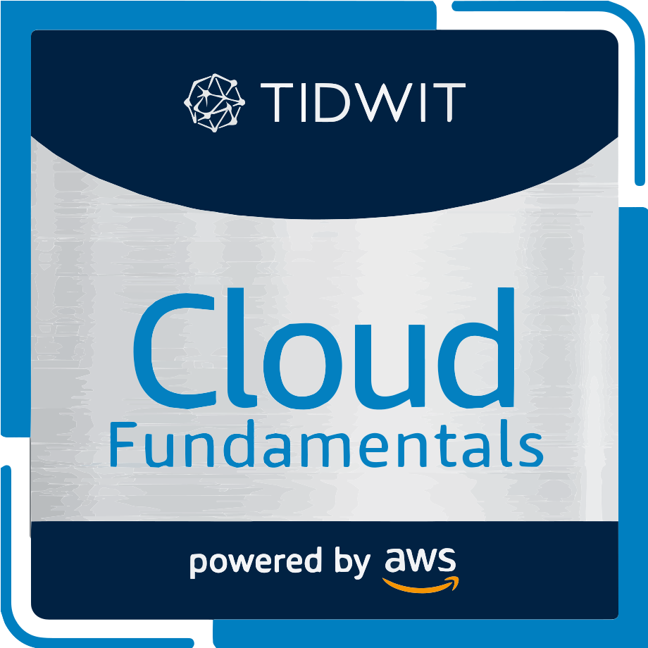

# Hi, I'm César Santos 👋

**Backend Engineer · Cloud Native enthusiast**

I build production systems with **Java/Spring and Python**, with experience in API design and databases. I'm expanding my work into **DevOps and Cloud Native**, focusing on Kubernetes, infrastructure automation, GitOps and reliability.

🌎 Open to **remote roles in Backend, Platform and DevOps**.

## Engineering Stack

**Backend & Databases**

**Cloud & DevOps**

More technologies

**Frameworks & Languages**

**GitOps & Packaging**

**Observability & Security**

## Current Focus

* Building backend services and APIs with **Java/Spring and Python**.
* Developing **PICKStack**, a Cloud Native platform with Kubernetes, GitOps, observability and SLO management.
* Studying **Kubernetes operations** toward the **CKA certification**.

Learning path & education

**Certification roadmap:** KCNA → CKAD → CKA → CKS, alongside AWS and RHCSA studies.

**Postgraduate studies:** Cybersecurity & Ethical Hacking at FIAP, in progress.

## Certifications & Credentials

* [**OCI 2025 Certified Foundations Associate**](https://catalog-education.oracle.com/ords/certview/sharebadge?id=E9D60ECCAD24BAE65F3794C035E8984F13AFB21CCCCEBAB73CECC89C5F20DA34) · Oracle
* [**OCI 2025 Certified AI Foundations Associate**](https://catalog-education.oracle.com/ords/certview/sharebadge?id=529BE94A3499D3896BEA37D98D2597F07F1C8547AA1057AA673044851D3CEA9F) · Oracle
* [**Uncomplicating Docker**](https://www.credential.net/4033f97c-52d2-4977-8658-69e3fc411db3) · LINUXtips
* [**Creating Pipelines and Automations with GitHub Actions**](https://www.credential.net/e38bee5c-e847-4b50-b4b5-304375a8af9c) — LINUXtips
* [**Cloud Fundamentals**](https://awstreinabrasil.ontidwit.com/badge?id=e605cbf0-cfff-4286-a31a-922eb2d8478e) · AWS Treina Brasil

View credential badges

| Oracle Foundations | Oracle AI Foundations |
|:---:|:---:|
|  |  |

| Docker | Cloud Fundamentals |
|:---:|:---:|
|  |  |

## Languages & Opportunities

**Portuguese:** Native · **English:** Intermediate, working toward fluency · **German:** Learning, targeting B1 by 2026.

